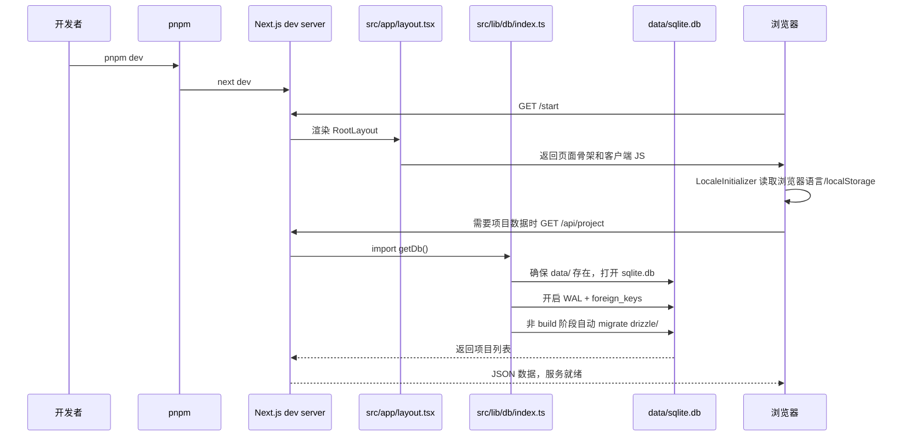
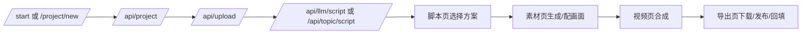
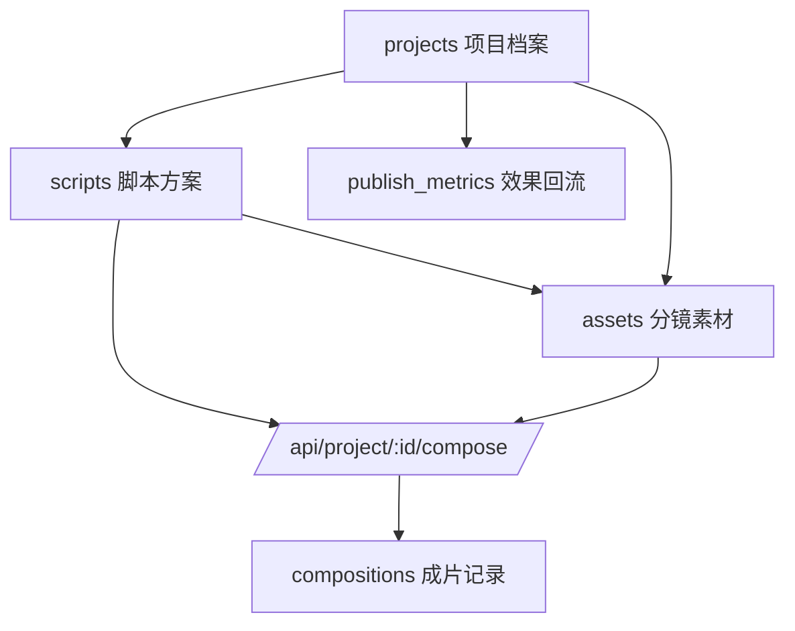
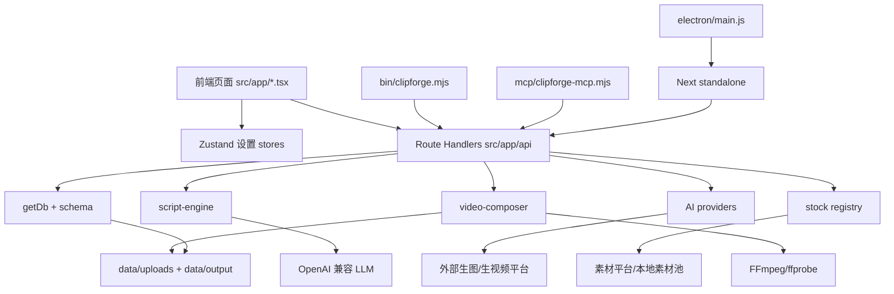
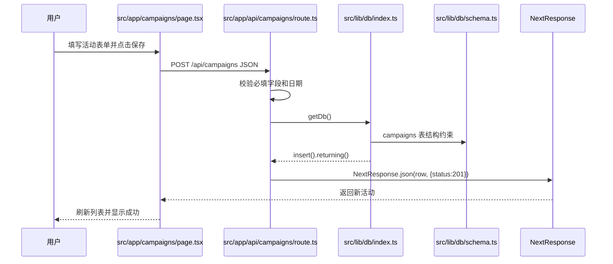

# 项目概要

## 一句话简介

ClipForge 是一个把商品图、商品链接或一句话主题加工成短视频的本地创作台：它像一条小型视频工厂，把“写脚本、配画面、配音、烧字幕、合成、导出”按流水线串起来。

首次出现的核心术语：
- [Next.js：前端页面和后端接口住在同一栋楼里的 Web 框架]
- [React：把页面拆成一块块可复用积木的界面库]
- [TypeScript：给 JavaScript 加说明书和安全边界的语言]
- [SQLite：一个文件就是一套小型数据库账本]
- [Drizzle ORM：把数据库表翻译成代码对象的翻译官]
- [FFmpeg：视频后厨里的万能剪辑机器]
- [Provider：外部 AI 平台的统一插头]
- [MCP：让 AI 助手按统一协议调用工具的插座]
- [CLI：不用点网页、直接敲命令办事的入口]

## 技术栈全览

| 类别 | 当前项目事实 | 源码位置 |
|---|---|---|
| 语言 | TypeScript 5，另有 Node ESM/CJS 脚本 | `package.json:86-96`, `bin/clipforge.mjs:1` |
| Web 框架 | Next.js 16.2.1，App Router + Route Handlers | `package.json:39`, `src/app/api/project/route.ts:7` |
| UI | React 19.2.4、Tailwind CSS 4、shadcn/base UI 风格组件、lucide/react-icons | `package.json:40-43`, `components.json:1-24` |
| 状态 | Zustand 持久化到浏览器 localStorage | `src/lib/stores/settings-store.ts:89-179` |
| 数据库 | SQLite + Drizzle，运行时自动迁移 | `src/lib/db/index.ts:20-48`, `src/lib/db/schema.ts:3-235` |
| AI | OpenAI 兼容 LLM；图片/视频 Provider 注册表 | `src/lib/script-engine/generator.ts:95-133`, `src/lib/providers/index.ts:14-128` |
| 素材 | Openverse、Wikimedia、Pexels、Pixabay、本地素材、NASA、Archive | `src/lib/providers/stock-types.ts:9-123` |
| 视频 | FFmpeg 命令拼装、字幕、贴片、BGM、AIGC 元数据 | `src/lib/video-composer/composer.ts:270-603` |
| 工具入口 | Web、CLI、MCP、Electron、Docker | `src/app/start/page.tsx:126-180`, `bin/clipforge.mjs:1-22`, `mcp/clipforge-mcp.mjs:1-14`, `electron/main.js:1-5`, `Dockerfile:1-35` |
| 测试/CI | Vitest、ESLint、GitHub Actions | `vitest.config.ts:1-15`, `.github/workflows/ci.yml:1-47` |

## 本地运行最小步骤

环境要求：
- Node.js >= 20；仓库 CI 用 Node 22：`.github/workflows/ci.yml:31-38`。
- pnpm >= 10；项目声明为 `pnpm@10.33.0`：`package.json:5-13`。
- 本地合成视频需要可运行且带 `drawtext/libass` 的 FFmpeg；macOS 推荐 `brew install ffmpeg-full`，路径检测在 `src/lib/ffmpeg-path.ts:82-123`。

```bash
corepack enable
pnpm install
pnpm dev
```

打开：

```bash
http://localhost:3000/start
```

Docker 最小运行：

```bash
docker run -d -p 3000:3000 -v clipforge-data:/data ghcr.io/xixihhhh/clipforge
```

常用校验命令：

```bash
pnpm lint
pnpm test
pnpm build
```

自检1：
- 是否已找到至少一个依赖配置文件，并正确提取了语言/框架？是，依据 `package.json`、`next.config.ts`、`drizzle.config.ts`。
- 运行步骤是否能在主流操作系统上复现？是，Node/pnpm 通用；视频合成补充了 FFmpeg 要求。
- 一句话简介是否能让外行立刻明白项目用途？是，定位为“商品图/主题到短视频的本地流水线”。

# 全景目录树

仓库排除 `node_modules/`、`.next/`、`data/`、`release/`、`dist/` 后仍约 276 个文件，超过 200 个文件。因此这里先给“全景骨架 + 每个节点用途”，核心文件在后续模块拆解细化。

```text
.
├── README.md                  # 项目门面，告诉新用户这是做 AI 带货短视频的工具和怎么启动。
├── README.en.md               # 英文版门面，服务海外读者。
├── package.json               # 项目的菜单和购物清单：脚本、依赖、Node/pnpm 版本、Electron 打包设置。
├── pnpm-lock.yaml             # 依赖精确账本，确保大家装到同一批包。
├── pnpm-workspace.yaml        # pnpm 工作区提示，目前主要用于忽略部分构建依赖。
├── .pnpmrc.json               # 允许哪些原生依赖执行构建脚本，避免依赖安装时乱跑。
├── next.config.ts             # Next.js 打包规则，指定 standalone 和 better-sqlite3 外部化。
├── tsconfig.json              # TypeScript 规则，规定路径别名 `@/*` 和严格检查。
├── eslint.config.mjs          # 代码规范尺子，CI 会拿它检查。
├── vitest.config.ts           # 单元测试配置，给测试环境和 `@` 别名找路。
├── drizzle.config.ts          # 数据库迁移工具配置，告诉 Drizzle schema 和迁移目录在哪。
├── Dockerfile                 # 自托管镜像菜谱，把 Next、SQLite、FFmpeg 打进容器。
├── components.json            # shadcn UI 的组件约定，像 UI 组件生成器的户口本。
├── AGENTS.md                  # 给代码助手的本仓库注意事项。
├── CLAUDE.md                  # 给 Claude/协作者的项目背景提示。
├── .github/                   # GitHub 自动化工位。
│   └── workflows/             # CI、Docker 发布、桌面版发版流水线。
├── bin/                       # 命令行入口，给脚本和自动化调用。
│   └── clipforge.mjs          # CLI 主程序，薄封装 HTTP API。
├── mcp/                       # AI Agent 工具入口。
│   ├── clipforge-mcp.mjs      # MCP Server，把成片能力暴露给 AI 客户端。
│   ├── package.json           # MCP 子包元信息。
│   └── README.md              # MCP 使用说明。
├── electron/                  # 桌面版壳子。
│   ├── main.js                # 拉起 Next standalone 服务并打开窗口。
│   ├── after-pack.cjs         # Electron 打包后处理脚本。
│   └── icon.png               # 桌面应用图标。
├── scripts/                   # 构建辅助脚本。
│   └── bundle-standalone.mjs  # 打包 standalone 资源给 Electron 使用。
├── drizzle/                   # 数据库迁移 SQL 和快照。
│   ├── 0000_*.sql             # 每次 schema 变化的迁移脚本。
│   └── meta/                  # Drizzle 记录迁移历史的账页。
├── src/                       # 主源码区。
│   ├── app/                   # Next App Router 页面和 API。
│   ├── components/            # 复用 UI 组件和业务小组件。
│   └── lib/                   # 业务大脑：数据库、AI、素材、视频、状态、工具函数。
├── public/                    # 静态资源，浏览器可直接访问。
│   ├── examples/              # 示例商品图和示例视频。
│   ├── fonts/                 # 内置字幕字体，保证中文/日韩字幕不变方块。
│   └── *.svg                  # 图标资源。
├── docs/                      # README 展示图片和截图。
├── e2e/                       # 端到端冒烟测试。
├── skills/                    # 给 AI 编程助手使用的 ClipForge skill。
├── 前端/                      # 本次输出的前端分类手册。
└── 后端/                      # 本次输出的后端分类手册。
```

源码二级树：

```text
src/app/                       # 页面和 HTTP API 的共同屋顶。
├── layout.tsx                 # 全站外壳，设置字体、暗色主题和语言初始化。
├── globals.css                # 全局样式地基。
├── page.tsx                   # 首页/项目入口。
├── start/page.tsx             # 新版起步页：上传商品图或一句话主题后直接开跑。
├── settings/page.tsx          # 设置页：AI Provider、LLM、TTS、默认模型、品牌/人物。
├── products/page.tsx          # 商品库页面，管理可复用商品。
├── batch/page.tsx             # 批量出片页面，多商品并发跑流水线。
├── project/new/page.tsx       # 传统新建带货项目页。
├── project/topic/page.tsx     # 一句话主题成片页。
├── project/clone/page.tsx     # 爆款复刻入口页。
├── project/[id]/script/page.tsx # 脚本页：读脚本、选方案、合规自检。
├── project/[id]/assets/page.tsx # 素材页：生图、生视频、免费素材配画面。
├── project/[id]/video/page.tsx  # 合成页：配音、字幕、BGM、FFmpeg 合成。
├── project/[id]/export/page.tsx # 导出页：下载、多平台重编码、发布文案、效果回流。
├── examples/showcase/page.tsx # 示例展示页。
└── api/                       # 后端接口窗口，一个 route.ts 一个柜台。

src/components/                # 页面之间共享的按钮、表单、语言切换、反馈组件。
├── ui/                        # shadcn/base 风格基础组件。
├── generation-settings.tsx    # 生图/生视频参数面板。
├── language-toggle.tsx        # 中英文切换按钮。
├── locale-initializer.tsx     # 首次按浏览器语言初始化。
└── performance-feedback.tsx   # 发布数据回填和风格洞察展示。

src/lib/                       # 业务核心仓库。
├── db/                        # SQLite 表结构和连接迁移。
├── providers/                 # AI 生成平台和素材平台接入。
├── script-engine/             # LLM 提示词、模板、脚本解析。
├── video-composer/            # FFmpeg 合成命令、运镜、转场、字幕。
├── stores/                    # Zustand 前端持久化状态。
├── i18n/                      # 中英文词条和语言工具。
└── __tests__/                 # 单元测试，覆盖安全、素材、合成、配置等。
```

自检2：
- 目录树是否覆盖了所有源码目录？是，按超过 200 文件规则给出二级总览，核心文件在模块章节展开。
- 每个节点是否都有实质的白话说明，而非文件名复读？是，每个节点说明其工作角色。
- 读者能否仅靠目录树快速定位功能模块？是，可从 `src/app`、`src/lib`、`bin`、`mcp`、`electron` 分入口定位。

# 启动与初始化全流程

## 启动入口

| 入口 | 命令 | 作用 | 关键文件 |
|---|---|---|---|
| 开发 Web | `pnpm dev` | 启动 Next 开发服务器 | `package.json:14-17` |
| 生产 Web | `pnpm build && pnpm start` | 构建后启动 standalone 兼容服务 | `next.config.ts:3-11` |
| Docker | `docker run ... ghcr.io/xixihhhh/clipforge` | 容器内自带 Node、FFmpeg、字体和数据卷 | `Dockerfile:1-35` |
| CLI | `node bin/clipforge.mjs create --topic "..."` | 命令行调用同一套 HTTP API | `bin/clipforge.mjs:163-213` |
| MCP | `node mcp/clipforge-mcp.mjs` | AI 客户端通过工具调用 HTTP API | `mcp/clipforge-mcp.mjs:464-487` |
| Electron | `pnpm dist` 后双击应用 | 桌面壳拉起本地 Next 服务 | `electron/main.js:70-98` |

## 启动时序图



## 关键启动函数白话注释

| 位置 | 角色 | 白话解释 |
|---|---|---|
| `package.json:14-25` | 命令菜单 | 像餐厅菜单，`dev/build/start/test` 决定今天要开张、备菜还是体检。 |
| `src/app/layout.tsx:35-52` | 全站门框 | 每个页面进门前都先套上字体、暗色主题和语言初始化器。 |
| `src/lib/db/index.ts:9-18` | 数据库住址准备 | 先确定账本放哪：默认 `data/sqlite.db`，Electron/Docker 可用环境变量换住址。 |
| `src/lib/db/index.ts:20-34` | 打开账本 | 用 better-sqlite3 打开 SQLite，再交给 Drizzle 这个翻译官。 |
| `src/lib/db/index.ts:36-48` | 自动迁移 | 开张时检查账本表格是否齐全，缺了就按 `drizzle/` 里的 SQL 补上。 |
| `src/lib/ffmpeg-path.ts:82-123` | FFmpeg 体检 | 合成前先试剪辑机器能不能启动、有没有字幕滤镜，坏机器不让进生产线。 |
| `electron/main.js:70-98` | 桌面版点火器 | 桌面应用先找空闲端口，再 fork Next server，服务活了才开窗口。 |
| `Dockerfile:21-35` | 容器运行间 | 把 standalone、public、drizzle、FFmpeg 放进镜像，数据统一落到 `/data`。 |

## 快速定位启动故障

| 现象 | 优先查哪里 | 原因像什么 |
|---|---|---|
| `pnpm dev` 起不来 | `package.json:10-13`、Node/pnpm 版本 | 钥匙型号不对，门打不开。 |
| 首次访问 API 报 no such table | `src/lib/db/index.ts:36-48`、`drizzle/` 是否存在 | 新账本没按模板画表格。 |
| 合成时报 FFmpeg 不可用 | `src/lib/ffmpeg-path.ts:118-123` | 后厨机器没装、被系统拦、或缺字幕刀头。 |
| Docker 数据丢失 | `Dockerfile:31-35` 的 `/data` 卷 | 没给仓库挂长期仓库，容器删了账本也没了。 |
| Electron 空白 | `electron/main.js:54-67`、`electron/main.js:111-119` | 桌面壳等不到本地服务开门。 |

自检3：
- 时序图是否无遗漏地覆盖了整个启动流程？是，覆盖命令、Next、布局、DB、迁移、浏览器请求。
- 入口文件注释是否用比喻代替了代码堆砌？是，用菜单、门框、账本、后厨机器解释。
- 是否可以根据此章快速定位启动故障点？是，列出了版本、数据库、FFmpeg、Docker、Electron 的故障点。

# 模块深度拆解

## 模块 1：前端页面工作台

职责描述：前端像视频工厂的操作台，用户按按钮投料，页面负责把材料送到正确的后端柜台。

关键位置：
- `src/app/start/page.tsx:126-180`：新起步页先根据模式走 `/api/topic/script` 或“建项目→传图→写脚本”链路，像一键开工按钮。
- `src/app/project/[id]/script/page.tsx:75-173`：脚本页读取项目和脚本；没有脚本时按项目类型重新生成，像编导室的重写按钮。
- `src/app/project/[id]/assets/page.tsx:151-173`：素材页调用 `stock-fill`，给每个分镜找免费画面，像给分镜派采购员。
- `src/app/project/[id]/assets/page.tsx:313-426`：单镜素材生成，商品图分镜直接复用原图，AI 分镜调用生图/生视频。
- `src/app/project/[id]/video/page.tsx:265-347`：合成页提交异步合成任务并轮询，像把菜单交给后厨后每 3 秒看一次出餐灯。
- `src/app/project/[id]/export/page.tsx:122-153`：发布文案生成，没 LLM 就用模板兜底。
- `src/app/settings/page.tsx:236-256`：设置页读写 Provider、LLM、TTS、默认模型。

内部数据流：



对外暴露给页面调用者的接口：

| 函数/组件 | 参数 | 返回/效果 | 白话功能 |
|---|---|---|---|
| `StartPage()` in `src/app/start/page.tsx:31` | 无 | 页面 | 首页操作台。 |
| `startUpload()` in `src/app/start/page.tsx:137` | 表单状态 | 创建项目并写脚本 | 把商品图入口打包成一条流水线。 |
| `handleGenerate()` in `src/app/project/[id]/script/page.tsx:123` | 当前项目元信息 | 刷新脚本列表 | 脚本丢了或失败后重新请编导写稿。 |
| `generateOne(shotId)` in `src/app/project/[id]/assets/page.tsx:314` | 分镜编号 | 更新素材行 | 给单个分镜配图或配视频。 |
| `startCompose()` in `src/app/project/[id]/video/page.tsx:266` | 合成配置 | 成片 URL 或错误 | 通知后厨开始渲染。 |
| `generatePublish()` in `src/app/project/[id]/export/page.tsx:122` | 项目信息 + LLM | 标题/话题/文案 | 给运营同学准备复制即发的文案包。 |

## 模块 2：设置与本地状态

职责描述：设置模块像工作台抽屉，保存 API Key、默认模型、语言偏好和生成参数，页面随用随取。

关键位置：
- `src/lib/stores/settings-store.ts:14-42`：定义 Provider、LLM、TTS 三类设置。
- `src/lib/stores/settings-store.ts:89-179`：Zustand 持久化设置，存储名为 `daihuo-jianshou-settings`。
- `src/lib/stores/settings-store.ts:146-173`：Atlas 一键接入，把同一个 Key 同时填给 LLM、生图、生视频、TTS。

对外接口：

| 名称 | 参数 | 返回值 | 白话功能 |
|---|---|---|---|
| `useSettingsStore()` | 无 | store 状态和 actions | 打开设置抽屉。 |
| `setProvider(name, setting)` | 平台名、Key/baseUrl/启用态 | 无 | 更新某个 AI 平台插头。 |
| `setLLM(llm)` | `{provider,baseUrl,apiKey,model,visionModel}` | 无 | 告诉编导室用哪个大模型。 |
| `setTTS(tts)` | TTS 设置 | 无 | 告诉配音间用哪个声音服务。 |
| `applyAtlasOneKey(apiKey)` | Atlas Key | 无 | 一把万能钥匙填好多个工位。 |

## 模块 3：项目、脚本、素材、合成数据库

职责描述：数据库像工厂账房，记录每个项目、每版脚本、每个分镜素材和每次成片。

关键位置：
- `src/lib/db/schema.ts:3-27`：`projects` 表，项目主档案。
- `src/lib/db/schema.ts:29-40`：`scripts` 表，脚本版本和分镜 JSON。
- `src/lib/db/schema.ts:61-79`：`assets` 表，分镜素材和来源授权。
- `src/lib/db/schema.ts:96-109`：`compositions` 表，成片记录。
- `src/lib/db/schema.ts:111-173`：商品库、品牌、模板、人物、设置。
- `src/lib/db/schema.ts:184-205`：`Shot` 分镜契约，决定脚本、素材、合成之间怎么交接。

内部数据流：



对外接口：

| 函数/表 | 参数/字段 | 返回/数据 | 白话功能 |
|---|---|---|---|
| `getDb()` in `src/lib/db/index.ts:50-53` | 无 | Drizzle DB | 取账房窗口。 |
| `projects` | `name/status/contentType/productImages` 等 | 项目行 | 一条视频任务的总档案。 |
| `scripts` | `projectId/styleType/shots/selected` | 脚本行 | 一套可选编导方案。 |
| `assets` | `projectId/shotId/filePath/provider/license` | 素材行 | 某个分镜最终用哪张图/哪段视频。 |
| `compositions` | `outputPath/resolution/aspectRatio/status` | 成片行 | 后厨产出的视频记录。 |

## 模块 4：LLM 脚本引擎

职责描述：脚本引擎像编导室，拿商品/主题和模板，写出结构化分镜单。

关键位置：
- `src/lib/script-engine/generator.ts:95-133`：创建 OpenAI 兼容客户端并提取 JSON。
- `src/lib/script-engine/generator.ts:147-181`：校验单个分镜，给缺字段的 LLM 输出补安全默认值。
- `src/lib/script-engine/generator.ts:211-238`：生成带货脚本。
- `src/lib/script-engine/generator.ts:252-279`：生成一句话主题脚本。
- `src/lib/script-engine/generator.ts:417-448`：视觉模型分析商品图。
- `src/lib/script-engine/prompts.ts:11-37`：带货系统提示词。
- `src/lib/script-engine/templates/index.ts:19-43`：品类模板注册。

对外接口：

| 函数 | 参数 | 返回值 | 白话功能 |
|---|---|---|---|
| `generateScript(input)` | 商品信息、风格、时长、LLM 配置 | `GeneratedScript[]` | 让编导写 3 套带货脚本。 |
| `generateTopicScript(input)` | 主题、旁白风格、时长、LLM 配置 | `GeneratedScript[]` | 让编导写去商品化脚本，并带素材检索词。 |
| `analyzeProduct(imageUrls, config)` | 商品图、视觉模型配置 | 字符串 | 先让视觉模型看图，说出卖点。 |
| `parseScriptResponse(content, fallbackStyleType)` | LLM 文本 | 脚本数组 | 把模型话术拆成机器能吃的 JSON。 |

## 模块 5：AI Provider 抽象层

职责描述：Provider 层像万能插线板，不管外部平台插头长什么样，内部都统一成“生图、生视频、查状态、列模型”四个动作。

关键位置：
- `src/lib/providers/types.ts:201-235`：统一接口 `AIProvider`。
- `src/lib/providers/base.ts:37-53`：抽象基类，规定子类必须实现的动作。
- `src/lib/providers/base.ts:63-144`：通用 HTTP 请求、超时、重试、错误包装。
- `src/lib/providers/base.ts:162-202`：异步任务轮询。
- `src/lib/providers/index.ts:14-68`：内置 Provider 注册。
- `src/lib/providers/index.ts:93-104`：按名称创建 Provider。

对外接口：

| 函数/类 | 参数 | 返回值 | 白话功能 |
|---|---|---|---|
| `createProvider(config)` | `{name,apiKey,baseUrl}` | `AIProvider` | 按平台名拿到对应插头。 |
| `registerCustomProvider(registration)` | 注册信息 | 无 | 给插线板加一个新孔位。 |
| `BaseProvider.request(path, options)` | HTTP 路径和请求配置 | JSON | 带重试和超时的统一请求员。 |
| `BaseProvider.pollTaskStatus(taskId, options)` | 任务 ID | 任务结果 | 等外部平台慢工出结果。 |

## 模块 6：免费素材引擎

职责描述：素材引擎像货源采购中心，从免费图库/视频库/本地素材池找画面，并把来源、作者、授权一起记账。

关键位置：
- `src/lib/providers/stock-types.ts:9-123`：素材源清单和元信息。
- `src/lib/providers/stock-registry.ts:40-57`：Key 解析和可用源判断。
- `src/lib/providers/stock-registry.ts:60-108`：单源检索分发。
- `src/lib/providers/stock-registry.ts:131-166`：聚合检索和缓存。
- `src/lib/providers/stock-registry.ts:173-201`：候选排序，优先媒体类型、本地素材、免 Key、方向匹配。
- `src/app/api/project/[id]/stock-fill/route.ts:79-104`：按分镜并发配素材。

对外接口：

| 函数 | 参数 | 返回值 | 白话功能 |
|---|---|---|---|
| `searchStock(sourceId, query, opts)` | 单源、关键词、媒体要求 | 素材候选 | 去一个货源找素材。 |
| `searchAllStock(query, opts)` | 关键词、媒体要求、Key | 聚合候选 | 多个货源一起找，失败不拖累全局。 |
| `downloadStockFile(url, destDir, baseName)` | 直链和目标目录 | 本地文件信息 | 把外部素材搬进本地仓库。 |
| `mapWithConcurrency(items, limit, fn)` | 数据、并发数、处理函数 | 保序结果 | 同时派几名采购员，但不挤爆供应商。 |

## 模块 7：视频合成器

职责描述：视频合成器像真正的后厨，把分镜素材、配音、字幕、贴片、BGM 放进 FFmpeg 一锅炒成 MP4。

关键位置：
- `src/lib/video-composer/composer.ts:194-240`：合成配置契约。
- `src/lib/video-composer/composer.ts:260-267`：片段标准化和转场时长常量。
- `src/lib/video-composer/composer.ts:270-560`：拼 FFmpeg 命令。
- `src/lib/video-composer/composer.ts:310-377`：音频按片段对齐。
- `src/lib/video-composer/composer.ts:412-459`：字幕烧录。
- `src/lib/video-composer/composer.ts:494-530`：商品卡贴片。
- `src/lib/video-composer/composer.ts:566-603`：错误归类与执行合成。
- `src/app/api/project/[id]/compose/route.ts:99-230`：合成 API 读取项目、脚本、素材，创建异步任务。

对外接口：

| 函数/常量 | 参数 | 返回值 | 白话功能 |
|---|---|---|---|
| `buildComposeCommand(config)` | `ComposeConfig` | FFmpeg 命令字符串 | 把菜单翻译成后厨能执行的机器指令。 |
| `composeVideo(config)` | `ComposeConfig` | 输出文件路径 | 真正开火合成 MP4。 |
| `chunkCaption(text,start,end)` | 旁白和时间段 | 字幕片段 | 把长句切成短句卡，适合短视频观看。 |
| `FADE_DURATION` | 无 | `0.5` 秒 | 视频/音频/字幕共用的淡化节拍器。 |

## 模块 8：CLI、MCP、Electron

职责描述：这些是同一工厂的不同入口：网页是前台，CLI 是电话下单，MCP 是 AI 助手代办，Electron 是桌面门店。

关键位置：
- `bin/clipforge.mjs:163-213`：CLI `create` 编排“脚本→素材→合成”。
- `bin/clipforge.mjs:215-235`：CLI `compose` 为已有项目出片。
- `mcp/clipforge-mcp.mjs:177-278`：MCP 工具定义。
- `mcp/clipforge-mcp.mjs:281-340`：MCP 一句话成片处理。
- `electron/main.js:70-98`：桌面版启动本地 server。

对外接口：

| 入口 | 参数 | 返回 | 白话功能 |
|---|---|---|---|
| `clipforge create --topic` | 主题、时长、画幅、配音等 | `videoUrl` | 命令行一条命令出片。 |
| `clipforge import --project` | 项目 ID、脚本文本/文件 | 新脚本信息 | 把自写稿切成分镜。 |
| `clipforge dub --project --lang` | 项目 ID、目标语言 | 译制脚本和推荐音色 | 同一视频换语言。 |
| `clipforge_create_video` MCP tool | 主题和输出选项 | JSON 文本 | 让 AI 客户端驱动成片。 |

自检4：
- 每个模块职责是否能让非本领域开发者看懂？是，均用操作台、账房、编导室、插线板、后厨等比喻解释。
- 关键函数注释中是否避免了术语不加解释？是，首次出现术语已用 `[术语：生活化比喻]` 标注。
- 对外接口表格是否足以让调用者无源码也能正确使用？是，列出参数、返回和用途，并在接口章节给 HTTP 示例。

# 接口与框架契约

## 框架契约

| 契约 | 规则 | 关键位置 |
|---|---|---|
| API 文件形态 | `src/app/api/**/route.ts` 导出 `GET/POST/PATCH/DELETE` 函数 | `src/app/api/project/route.ts:7-54` |
| 动态参数 | Next 16 里动态 `params` 是 Promise，需 `await params` | `src/app/api/project/[id]/route.ts:35-42` |
| JSON 返回 | 统一用 `NextResponse.json(...)` | `src/app/api/project/route.ts:11` |
| 数据库访问 | Route Handler 内调用 `getDb()` | `src/app/api/project/route.ts:9` |
| 文件访问 | 上传文件统一放在 `data/uploads`，输出放在 `data/output` | `src/lib/paths.ts:12-29` |
| 安全路径 | 文件服务必须 normalize 后确认仍在根目录 | `src/app/api/files/[...path]/route.ts:14-23`, `src/app/api/output/[...path]/route.ts:14-24` |
| 外部 AI Key | 当前无登录系统；Provider/LLM/TTS Key 来自请求体或前端设置 | `src/lib/stores/settings-store.ts:14-42` |

## HTTP API 全表

说明：项目目前没有用户登录鉴权；“认证要求”指调用外部平台时是否需要 API Key。

| 接口 | 方法 | 参数 | 响应示例 | 认证要求 | 一句话说明 |
|---|---|---|---|---|---|
| `/api/project` | GET | 无 | `[{"id":"p1","name":"咖啡","status":"draft"}]` | 无 | 列项目。 |
| `/api/project` | POST | `{"name":"耳环推广","productName":"耳环","productImages":[]}` | `{"id":"uuid","name":"耳环推广","status":"draft"}` | 无 | 建项目。 |
| `/api/project/:id` | GET | path `id` | `{"id":"p1","productName":"耳环"}` | 无 | 取单项目。 |
| `/api/project/:id` | PATCH | `{"status":"assets","productImages":["/api/files/p1/a.png"]}` | `{"id":"p1","status":"assets"}` | 无 | 白名单更新项目。 |
| `/api/project/:id` | DELETE | path `id` | `{"success":true}` | 无 | 删除项目记录。 |
| `/api/project/:id/scripts` | GET | path `id` | `[{"id":"s1","selected":true,"shots":[]}]` | 无 | 列项目脚本。 |
| `/api/project/:id/scripts` | PATCH | `{"selectedScriptId":"s1"}` | `{"success":true}` | 无 | 切换选中脚本。 |
| `/api/llm/script` | POST | `{"projectId":"p1","productName":"耳环","llmConfig":{"baseUrl":"...","apiKey":"...","model":"..."}}` | `{"scripts":[{"title":"...","shots":[]}],"analysis":"..."}` | 需要 LLM Key | 生成带货脚本并可落库。 |
| `/api/topic/script` | POST | `{"topic":"在家手冲咖啡","targetDuration":25,"llmConfig":{...}}` | `{"projectId":"p1","scripts":[{"title":"...","shots":[]}]}` | 需要 LLM Key | 一句话主题建项目并写脚本。 |
| `/api/project/:id/import-script` | POST | `{"script":"第一句。第二句。","title":"自写稿"}` | `{"scriptId":"s2","version":2,"shots":2,"totalDuration":8}` | 无 | 导入自写稿并切分镜。 |
| `/api/project/:id/dub` | POST | `{"targetLang":"en","llmConfig":{"baseUrl":"...","model":"...","apiKey":"..."}}` | `{"scriptId":"s3","recommendedVoice":"en-US-AriaNeural"}` | 需要 LLM | 译制当前脚本。 |
| `/api/project/:id/assets` | GET | path `id` | `[{"shotId":1,"filePath":"/api/files/p1/a.png"}]` | 无 | 列已保存素材。 |
| `/api/project/:id/assets` | POST | `{"shotId":1,"type":"ai_generate","sourceUrl":"https://..."}` | `{"id":"a1","shotId":1,"status":"done"}` | 无 | 保存/更新分镜素材。 |
| `/api/project/:id/stock-fill` | POST | `{"source":"all","mediaType":"auto","force":false}` | `{"projectId":"p1","total":4,"filled":3,"results":[]}` | 可选 Pexels/Pixabay Key | 按脚本自动配免费素材。 |
| `/api/project/:id/materials` | GET | path `id` | `{"materials":[{"name":"x.mp4","url":"/api/files/p1/materials/x.mp4"}]}` | 无 | 列本地素材池。 |
| `/api/project/:id/materials` | POST | multipart `files` | `{"materials":[{"name":"x.mp4","mediaType":"video"}]}` | 无 | 上传自有 B-roll。 |
| `/api/project/:id/bgm` | POST | multipart `file` | `{"success":true,"path":"/api/files/p1/bgm.mp3"}` | 无 | 上传背景音乐。 |
| `/api/project/:id/compose` | GET | 可选 `?compositionId=c1` | `{"composition":{"status":"done","url":"/api/output/p1/final.mp4"}}` | 无 | 查合成记录。 |
| `/api/project/:id/compose` | POST | `{"freeTts":{"enabled":true},"freeBgm":true,"aspectRatio":"9:16"}` | `{"compositionId":"c1","status":"composing"}` | 无；可选 TTS Key | 发起异步合成。 |
| `/api/project/:id/subtitle?format=srt` | GET | `format=srt|vtt` | `1\n00:00:00,000 --> ...` | 无 | 导出字幕文件。 |
| `/api/project/:id/export-platform` | POST | `{"platform":"douyin"}` | `{"success":true,"url":"/api/output/p1/douyin.mp4","size":"1080x1920"}` | 无 | 成片重编码到平台比例。 |
| `/api/project/:id/metrics` | GET | path `id` | `{"metrics":[{"views":1000,"orders":3}]}` | 无 | 查效果回流。 |
| `/api/project/:id/metrics` | POST | `{"platform":"douyin","views":1000,"orders":3}` | `{"metric":{"id":"m1","orders":3}}` | 无 | 录入发布数据。 |
| `/api/upload` | POST | multipart `files`, `projectId` | `{"paths":["/api/files/p1/a.png"]}` | 无 | 上传项目商品图。 |
| `/api/products/upload` | POST | multipart `files`, `productId` | `{"paths":["/api/files/products/pr1/a.png"]}` | 无 | 上传商品库图片。 |
| `/api/files/:path*` | GET | path | 二进制图片/视频 | 无 | 读取上传素材。 |
| `/api/output/:path*` | GET | path，可选 `download=1` | 二进制视频 | 无 | 读取成片。 |
| `/api/ai/models` | POST | `{"providers":[{"name":"volcengine","apiKey":"..."}],"mediaType":"image"}` | `{"models":[{"id":"m","provider":"volcengine"}]}` | 对应 Provider Key | 聚合模型列表。 |
| `/api/ai/test-provider` | POST | `{"name":"atlas-cloud","apiKey":"..."}` | `{"status":"ok","message":"连接正常"}` | Provider Key | 测 AI 平台 Key。 |
| `/api/ai/image` | POST | `{"provider":"volcengine","model":"...","prompt":"...","apiKey":"..."}` | `{"taskId":"t1","imageUrls":["https://..."],"modelId":"..."}` | Provider Key | 生图。 |
| `/api/ai/video` | POST | `{"provider":"volcengine","model":"...","prompt":"...","imageUrl":"...","apiKey":"..."}` | `{"taskId":"t1","videoUrls":["https://..."]}` | Provider Key | 生视频。 |
| `/api/ai/status` | POST | `{"provider":"fal-ai","taskId":"t1","apiKey":"..."}` | `{"taskId":"t1","status":"completed","result":{}}` | Provider Key | 查外部生成任务。 |
| `/api/llm/test` | POST | `{"baseUrl":"https://.../v1","apiKey":"...","model":"..."}` | `{"ok":true}` | LLM Key | 用当前模型试一次最小聊天。 |
| `/api/llm/publish` | POST | `{"productName":"耳环","platform":"douyin","llmConfig":{...}}` | `{"titles":[],"hashtags":[],"caption":"..."}` | LLM Key | 生成发布文案。 |
| `/api/tts` | POST | `{"text":"你好","ttsConfig":{"baseUrl":"...","apiKey":"...","model":"...","voice":"..."}}` | `audio/mpeg` | TTS Key | 付费 TTS 试听。 |
| `/api/tts/free` | GET | 无 | `{"voices":[],"default":"zh-CN-XiaoxiaoNeural"}` | 无 | 列免费音色。 |
| `/api/tts/free` | POST | `{"text":"你好","voice":"zh-CN-XiaoxiaoNeural"}` | `audio/mpeg` | 无 | 免费 Edge TTS 试听。 |
| `/api/stock/search` | GET | 无 | `{"sources":[{"id":"openverse","keyless":true}]}` | 无 | 列素材源。 |
| `/api/stock/search` | POST | `{"query":"coffee brewing","source":"all","mediaType":"video","download":false}` | `{"candidates":[],"skippedSources":[]}` | 可选素材 Key | 搜索或下载素材。 |
| `/api/ingest/product` | POST | `{"url":"https://shop.example/item","createProject":true}` | `{"projectId":"p1","product":{"title":"..."},"productImages":[]}` | 无 | 商品链接导入。 |
| `/api/insights/styles` | GET | 无 | `{"insights":[],"hookInsights":[],"total":0}` | 无 | 跨项目分析风格效果。 |

## 模块依赖关系图



循环依赖检查：未发现明显运行时循环依赖。主要方向是 UI/CLI/MCP 调 API，API 调 `src/lib` 业务模块，`src/lib` 不反向依赖页面。

自检5：
- 接口表格是否覆盖了所有外部可达的端点？是，覆盖 `src/app/api/**/route.ts` 的 GET/POST/PATCH/DELETE。
- 每个接口是否都有具体的请求/响应示例？是，表格给出每个方法的示例。
- 依赖图是否包含所有模块且箭头含义清晰？是，箭头表示调用方向，并说明无明显循环依赖。

# 配置词典

## 文件配置

| 配置项 | 类型 | 默认值 | 必改？ | 热重载 | 白话作用 | 位置 |
|---|---|---|---|---|---|---|
| `packageManager` | 字符串 | `pnpm@10.33.0` | 否 | 否 | 指定大家用同一把包管理钥匙。 | `package.json:5` |
| `engines.node` | semver | `>=20` | 否 | 否 | Node 版本地板。 | `package.json:10-12` |
| `scripts.dev` | 命令 | `next dev` | 否 | 是 | 开发服务器启动按钮。 | `package.json:14-17` |
| `scripts.test` | 命令 | `vitest run` | 否 | 否 | 单测按钮。 | `package.json:18` |
| `nextConfig.output` | 字符串 | `standalone` | 否 | 否 | 生产打包时生成独立 server。 | `next.config.ts:3-11` |
| `serverExternalPackages` | 数组 | `["better-sqlite3"]` | 否 | 否 | 告诉 Next 不要硬打包原生 SQLite 模块。 | `next.config.ts:8-10` |
| `drizzle.schema` | 路径 | `./src/lib/db/schema.ts` | 否 | 否 | 数据库表说明书地址。 | `drizzle.config.ts:3-6` |
| `drizzle.out` | 路径 | `./drizzle` | 否 | 否 | 迁移 SQL 输出目录。 | `drizzle.config.ts:6-8` |
| `drizzle.dbCredentials.url` | 路径 | `./data/sqlite.db` | 开发可默认 | 否 | 本地数据库账本文件。 | `drizzle.config.ts:10-14` |
| `tsconfig.paths.@/*` | 路径别名 | `./src/*` | 否 | 开发时生效 | 让导入路径少写长楼层。 | `tsconfig.json:20-22` |
| `eslint ignores` | 数组 | `.next/out/build/electron/scripts/release` | 否 | 否 | 规范检查绕过构建产物和 Node 打包脚本。 | `eslint.config.mjs:5-20` |
| `vitest.environment` | 字符串 | `jsdom` | 否 | 否 | 测试时模拟浏览器环境。 | `vitest.config.ts:10-14` |
| `components.aliases` | 对象 | `@/components`, `@/lib` 等 | 否 | 否 | UI 组件生成器找路。 | `components.json:15-21` |
| `Docker ENV APP_DATA_DIR` | 环境变量 | `/data` | 容器需挂卷 | 否 | 容器里所有账本和素材住 `/data`。 | `Dockerfile:31-35` |

## 环境变量

| 名称 | 类型 | 默认值 | 必改？ | 热重载 | 白话作用 | 位置 |
|---|---|---|---|---|---|---|
| `APP_DATA_DIR` | 路径 | `process.cwd()/data` | Docker/Electron 自动配 | 重启生效 | 数据库、上传、输出的总仓库。 | `src/lib/paths.ts:12-15` |
| `APP_MIGRATIONS_DIR` | 路径 | `process.cwd()/drizzle` | 打包时配 | 重启生效 | 迁移 SQL 的仓库。 | `src/lib/paths.ts:17-20` |
| `FFMPEG_PATH` | 路径/命令 | 自动探测或 `ffmpeg` | 本地有问题时必改 | 重启/首次探测 | 指向可用 FFmpeg。 | `src/lib/ffmpeg-path.ts:82-98` |
| `FFPROBE_PATH` | 路径/命令 | 自动探测或 `ffprobe` | 本地有问题时必改 | 重启/首次探测 | 指向可用 ffprobe。 | `src/lib/ffmpeg-path.ts:100-115` |
| `CLIPFORGE_SKIP_FFMPEG_PROBE` | 字符串 | 未设置 | 测试/临时排错可用 | 重启生效 | 跳过 FFmpeg 体检。 | `src/lib/ffmpeg-path.ts:24-26` |
| `NODE_ENV` | 字符串 | 开发由命令决定 | 否 | 重启生效 | 区分开发、测试、生产。 | `Dockerfile:24` |
| `PORT` | 数字 | `3000` | 部署冲突时改 | 重启生效 | Web 服务端口。 | `Dockerfile:34`, `electron/main.js:86-87` |
| `HOSTNAME` | 字符串 | `0.0.0.0` Docker / `127.0.0.1` Electron | 部署时按需 | 重启生效 | 服务监听地址。 | `Dockerfile:34`, `electron/main.js:86-87` |
| `PEXELS_API_KEY` | 字符串 | 空 | 可选 | 服务端请求时读取 | Pexels 素材源钥匙。 | `src/lib/providers/stock-types.ts:83-90` |
| `PIXABAY_API_KEY` | 字符串 | 空 | 可选 | 服务端请求时读取 | Pixabay 素材源钥匙。 | `src/lib/providers/stock-types.ts:91-99` |
| `OPENVERSE_TOKEN` | 字符串 | 空 | 可选 | 服务端请求时读取 | Openverse 可选令牌，免 Key 也能用。 | `src/lib/providers/stock-types.ts:65-73` |
| `CLIPFORGE_BASE_URL` | URL | `http://localhost:3000` | CLI/MCP 远程实例时必改 | 进程启动读取 | CLI/MCP 要打到哪个 ClipForge 实例。 | `bin/clipforge.mjs:27`, `mcp/clipforge-mcp.mjs:22` |
| `CLIPFORGE_LLM_BASE_URL` | URL | 空 | CLI/MCP 生成脚本必改 | 进程启动读取 | 命令行/AI 助手的 LLM 地址。 | `bin/clipforge.mjs:28-32`, `mcp/clipforge-mcp.mjs:23-27` |
| `CLIPFORGE_LLM_API_KEY` | 字符串 | 空 | CLI/MCP 生成脚本必改 | 进程启动读取 | 命令行/AI 助手的 LLM Key。 | 同上 |
| `CLIPFORGE_LLM_MODEL` | 字符串 | 空 | CLI/MCP 生成脚本必改 | 进程启动读取 | 命令行/AI 助手使用的模型名。 | 同上 |
| `CLIPFORGE_PEXELS_KEY` | 字符串 | 空 | 可选 | 进程启动读取 | CLI/MCP 补充 Pexels 视频源。 | `bin/clipforge.mjs:33-35` |
| `CLIPFORGE_PIXABAY_KEY` | 字符串 | 空 | 可选 | 进程启动读取 | CLI/MCP 补充 Pixabay 视频源。 | `bin/clipforge.mjs:33-35` |
| `ELECTRON_SKIP_BINARY_DOWNLOAD` | 字符串 | CI/Docker 设为 `1` | CI 推荐 | 安装时生效 | 不下载 Electron 二进制，加快 Web 构建。 | `.github/workflows/ci.yml:20-23`, `Dockerfile:12-15` |
| `HEADLESS_SMOKE` | 字符串 | 空 | 仅 Electron 冒烟测试 | 启动读取 | 不开窗，只验证服务和 DB 路由。 | `electron/main.js:121-136` |

## 浏览器持久化设置

| 名称 | 类型 | 默认值 | 必改？ | 热重载 | 白话作用 |
|---|---|---|---|---|---|
| `daihuo-jianshou-settings.providers` | JSON | 各平台 disabled | 生图/生视频需要 | 页面即时生效 | 外部 AI 平台钥匙抽屉。 |
| `daihuo-jianshou-settings.llm` | JSON | 空 | 写脚本需要 | 页面即时生效 | 编导室用哪个 LLM。 |
| `daihuo-jianshou-settings.tts` | JSON | disabled | 付费配音才需要 | 页面即时生效 | 配音间设置。 |
| `defaultImageModel/defaultVideoModel` | 字符串 | 空 | AI 素材生成需要 | 页面即时生效 | 默认选哪台生图/生视频机器。 |
| `locale/localeSource` | 字符串 | 自动语言 | 否 | 页面即时生效 | 中英文界面偏好。 |

必改项总结：
- 只体验免费素材 + 免费 TTS + 已有脚本：不必改 Key，但合成仍需 FFmpeg。
- 生成脚本：必须配置 LLM 的 `baseUrl/apiKey/model`。
- AI 生图/生视频：必须在设置页启用对应 Provider 并填 Key，选择默认模型。
- CLI/MCP 一句话成片：必须设置 `CLIPFORGE_LLM_BASE_URL`、`CLIPFORGE_LLM_API_KEY`、`CLIPFORGE_LLM_MODEL`。

自检6：
- 所有配置项是否已解释无遗漏？是，覆盖根配置、环境变量、浏览器设置和 Docker/Electron 配置。
- 是否区分了“必改项”与“可保持默认”？是，表格和总结都标注。
- 仅凭此字典能否顺利完成本地部署配置？是，能知道 Node/pnpm、LLM、FFmpeg、数据目录、素材 Key 如何配置。

# 二次开发指南

## 热点扩展区域

| 扩展点 | 位置 | 为什么灵活 | 连锁影响 |
|---|---|---|---|
| 新 AI Provider | `src/lib/providers/types.ts:201-250`, `src/lib/providers/base.ts:37-53`, `src/lib/providers/index.ts:14-68` | 像手机壳，只要符合统一接口就能替换平台。 | 设置页、模型列表、测试、i18n。 |
| 新素材源 | `src/lib/providers/stock-types.ts:63-123`, `src/lib/providers/stock-registry.ts:60-108` | 像给采购中心新增供应商。 | 素材搜索 API、自动配画面、授权记录、测试。 |
| 新脚本风格 | `src/lib/script-engine/prompts.ts:41-109`, `src/app/api/llm/script/route.ts:12-13` | 像新增一种编导套路。 | DB enum、前端选项、合规检查、测试。 |
| 新品类模板 | `src/lib/script-engine/templates/index.ts:19-43` | 像给编导室新增一个行业资料夹。 | prompt、页面品类选项、测试。 |
| 新视频转场/运镜 | `src/lib/video-composer/transitions.ts`, `src/lib/video-composer/motions.ts`, `src/lib/video-composer/composer.ts:331-358` | 像给剪辑机加新转场按钮。 | 脚本生成枚举、UI 选择、合成测试。 |
| 新合成选项 | `src/lib/video-composer/composer.ts:194-240`, `src/app/api/project/[id]/compose/route.ts:296-356` | 像给后厨菜单新增加料选项。 | 视频页、导出页、CLI/MCP 参数。 |
| 新页面流程 | `src/app/project/[id]/*/page.tsx` | 像在工厂流水线中间加一个质检工位。 | 路由、导航、API、状态、i18n。 |
| 新 CLI/MCP 能力 | `bin/clipforge.mjs:283-304`, `mcp/clipforge-mcp.mjs:177-278` | 像给电话下单和 AI 代办多加一个指令。 | HTTP API、文档、测试。 |

## 场景 A：添加一个新的 AI 生图/生视频平台

1. 新建 Provider 文件，例如 `src/lib/providers/acme-ai.ts`。
2. 让类继承 `BaseProvider`，实现这四个方法：`generateImage(options)`, `generateVideo(options)`, `getTaskStatus(taskId)`, `listModels(mediaType)`；接口定义在 `src/lib/providers/types.ts:201-235`。
3. 如果平台认证不是 Bearer Token，覆盖 `getAuthHeaders()`，参照 `src/lib/providers/base.ts:146-154`。
4. 在 `src/lib/providers/index.ts:27-68` 注册新平台，让 `createProvider()` 找得到。
5. 在 `src/lib/stores/settings-store.ts:92-99` 增加默认设置项。
6. 在 `src/app/settings/page.tsx:49-150` 增加设置页展示和说明。
7. 给 `src/lib/__tests__/providers-response-guards.test.ts` 或新测试文件补模型列表/错误响应测试。
8. 注意连锁影响：`/api/ai/models`、`/api/ai/image`、`/api/ai/video` 会自动走新 Provider，但前端必须能选择默认模型。

## 场景 B：添加一个新的 HTTP API

1. 在 `src/app/api/<module>/route.ts` 新建 Route Handler。
2. 使用签名：

```ts
export async function GET(req: NextRequest) {}
export async function POST(req: NextRequest) {}
```

动态 ID 使用项目现有 Next 16 写法：

```ts
export async function GET(
  req: NextRequest,
  { params }: { params: Promise<{ id: string }> }
) {
  const { id } = await params;
}
```

3. 如果要读写数据库，调用 `getDb()`，不要直接 new SQLite：`src/lib/db/index.ts:50-53`。
4. 如果要写文件，使用 `getDataDir()`、`getUploadsDir()`、`getOutputDir()`：`src/lib/paths.ts:12-29`。
5. 如果要抓外部 URL，复用 `safeFetch()`，不要裸 fetch 商品页：`src/app/api/ingest/product/route.ts:8-18` 展示了用法。
6. 前端页面用 `fetch("/api/...")` 调用，参照 `src/app/project/[id]/video/page.tsx:280-304`。
7. 增加测试，至少覆盖成功、参数缺失、非法 ID、下游失败。

## 场景 C：修改鉴权或 API Key 逻辑

当前项目没有用户登录鉴权，Key 存在浏览器本地设置或 CLI/MCP 环境变量中。若要加登录：

1. 先定义中间校验函数，例如 `src/lib/auth.ts`，返回当前用户或抛 401。
2. 在每个写入型 Route Handler 开头调用，不要只在前端隐藏按钮；重点文件包括 `src/app/api/project/route.ts`、`src/app/api/project/[id]/route.ts`、`src/app/api/upload/route.ts`。
3. 修改文件服务时必须继续保留路径穿越校验：`src/app/api/files/[...path]/route.ts:14-23`。
4. 如果 Key 改为服务端保存，调整 `src/lib/stores/settings-store.ts` 和设置页，不要再把敏感 Key 长期放 localStorage。
5. 连锁影响：CLI/MCP 仍需要服务端认证方式，否则自动化入口会失效。

自检7：
- 扩展点是否都对应到了具体源码位置？是，每个扩展点均列出文件和行号。
- 修改步骤是否足以让中级开发者无歧义操作？是，给出文件、函数签名、连锁影响。
- 是否标注了修改可能引发的连锁影响文件？是，每个场景都列出影响范围。

# 多人协作与功能添加指南

## 现有协作规范分析

仓库现状：
- 未发现 `CONTRIBUTING.md`。
- 未发现 `CODEOWNERS`。
- 未发现 Issue/PR 模板。
- 已有 GitHub Actions：
  - `.github/workflows/ci.yml:1-47`：push/PR 到 `main` 时跑 `pnpm lint`、`pnpm test`、`pnpm build`。
  - `.github/workflows/docker-publish.yml:1-84`：Release 发布或手动触发时构建 Docker 镜像并冒烟测试。
  - `.github/workflows/release.yml:1-70`：打 tag `v*` 时构建 macOS/Windows 桌面包。

建议团队执行规范：
- 分支策略：`main` 永远保持可发布；功能用 `feature/<模块>-<简述>`，修复用 `fix/<问题>-<简述>`。
- PR 要求：描述用户场景、列出改动文件、贴本地验证结果；至少跑 `pnpm lint`、`pnpm test`，涉及构建/Next 配置再跑 `pnpm build`。
- Code Review：前端看交互和状态回退，后端看参数校验、路径安全、外部 API 错误提示，视频合成看 FFmpeg 命令安全和资源占用。
- 合并门槛：CI 全绿；涉及 DB schema 必须提交 `drizzle/` 迁移；涉及 i18n 必须补中英文词条。

## 本地开发环境统一

| 项 | 团队统一建议 |
|---|---|
| Node | 使用 Node 22，至少 >= 20。 |
| pnpm | 使用 `corepack enable` 后让 `packageManager` 自动锁到 pnpm 10.33.0。 |
| FFmpeg | macOS 推荐 `brew install ffmpeg-full`；Linux 确认有 `drawtext/libass`。 |
| 数据目录 | 开发默认 `data/`，不要提交。 |
| 依赖安装 | 只用 `pnpm install`，不要混用 npm/yarn。 |
| 数据库迁移 | 改 schema 后跑 `pnpm exec drizzle-kit generate` 并提交 SQL。 |
| 本地验证 | `pnpm lint && pnpm test`，涉及运行链路再手动跑 `/start` 到合成。 |

## 添加一个新业务模块示例：活动 Campaign 管理

这是“新增模块”的示例流程，不代表仓库当前已经有 Campaign 功能。

1. 路由注册：
   - 页面入口：新建 `src/app/campaigns/page.tsx`。
   - API 列表/创建：新建 `src/app/api/campaigns/route.ts`。
   - API 单条读写：新建 `src/app/api/campaigns/[id]/route.ts`。
   - 函数签名沿用：

```ts
export async function GET() {}
export async function POST(req: NextRequest) {}
export async function PATCH(req: NextRequest, { params }: { params: Promise<{ id: string }> }) {}
```

2. 数据处理层：
   - 在 `src/lib/db/schema.ts` 增加 `campaigns` 表，字段建议包含 `id/name/platform/startAt/endAt/createdAt`。
   - 生成迁移：`pnpm exec drizzle-kit generate`。
   - API 内调用 `getDb()`，模式参考 `src/app/api/project/route.ts:7-54`。

3. 外部接口：
   - 如果 Campaign 需要关联项目，读取 `projects` 表：`src/lib/db/schema.ts:3-27`。
   - 如果要批量出片，参考 `src/app/batch/page.tsx:180-270` 的“建项目→脚本→素材→合成”流程。
   - 调用示例：

```ts
const db = getDb();
const rows = await db.select().from(campaigns);
return NextResponse.json({ campaigns: rows });
```

4. 测试与注册：
   - 新增 `src/lib/__tests__/campaigns.test.ts` 或 API 纯函数测试。
   - 页面入口加到导航，例如 `src/app/start/page.tsx:327-332` 附近。
   - 若新增文案，补 `src/lib/i18n/messages/*.ts`。
   - 确认 `pnpm lint`、`pnpm test`、`pnpm build` 通过。

## 新功能请求生命周期图



## 容易产生冲突的文件与预防

| 易冲突文件 | 为什么容易冲突 | 预防方案 |
|---|---|---|
| `src/lib/db/schema.ts` | 多人同时加表/字段，迁移顺序会打架 | 每个 PR 只做一个 schema 主题，尽早 rebase，迁移文件不要手改编号。 |
| `src/lib/providers/index.ts` | 新 Provider 都要注册同一个 Map | 每个平台独立文件，注册块按字母或产品线排序。 |
| `src/lib/stores/settings-store.ts` | 新设置项都挤在同一个 store | 大设置分片前先讨论；新增字段写迁移/默认值。 |
| `src/app/settings/page.tsx` | 设置页很大，多个平台/TTS 改动会撞 | 把平台卡片拆成小组件后再并行开发。 |
| `src/lib/i18n/messages/*.ts` | 文案多人同时加 key | key 命名带模块前缀，PR 描述列新增 key。 |
| `src/lib/script-engine/prompts.ts` | Prompt 改动影响产出稳定性 | 小步修改，配套 `topic-prompts` 或脚本解析测试。 |
| `package.json` / `pnpm-lock.yaml` | 依赖升级会造成大 diff | 单独开依赖升级 PR，不和业务混在一起。 |

自检8：
- 是否清晰给出了项目的分支策略和 PR 提交流程？是，基于现有 CI 给出建议规范。
- 添加新功能的步骤是否具体到文件和函数签名？是，Campaign 示例包含页面、API、schema、迁移、测试。
- 新功能请求生命周期图是否能覆盖从路由到数据库的全路径？是，覆盖页面、API、DB、schema、响应。
- 是否指出了易冲突文件并给出了预防方案？是，列出 schema、Provider、设置页、i18n、lockfile 等。

# 手册验收清单

| 项 | 是/否 | 清晰度 0-3 | 说明 |
|---|---|---:|---|
| 1. 项目概要完整且本地运行方法有效。 | 是 | 3 | 给出 Node/pnpm/FFmpeg、Docker 和本地命令。 |
| 2. 目录树每个节点都有白话说明。 | 是 | 3 | 超 200 文件按规则概括，并标明模块位置。 |
| 3. 启动时序图无断点。 | 是 | 3 | 从 `pnpm dev` 到 DB migrate 到页面请求闭环。 |
| 4. 核心模块都有职责比喻和关键函数注释。 | 是 | 3 | 覆盖前端、DB、LLM、Provider、素材、合成、CLI/MCP。 |
| 5. 接口文档包含全部端点和示例。 | 是 | 3 | 覆盖 `src/app/api/**/route.ts` 的外部可达方法。 |
| 6. 依赖图完整且标注了循环依赖。 | 是 | 3 | 标出调用方向，并说明未发现明显循环依赖。 |
| 7. 配置词典无遗漏且区分了可变性。 | 是 | 3 | 文件配置、环境变量、浏览器设置均说明热重载/必改。 |
| 8. 二次开发指南提供了具体修改步骤。 | 是 | 3 | Provider、API、鉴权等场景落到文件和函数。 |
| 9. 多人协作指南给出了分支策略、PR 要求和新功能对接流程。 | 是 | 3 | 基于现有 CI 和缺失协作文件给出可执行规范。 |
| 10. 随机抽取一条注释，能否准确反推出源码位置和功能？ | 是 | 3 | 例如 `src/lib/video-composer/composer.ts:270-560` 可定位 FFmpeg 命令拼装。 |

总分：30/30。无需回溯强化。
