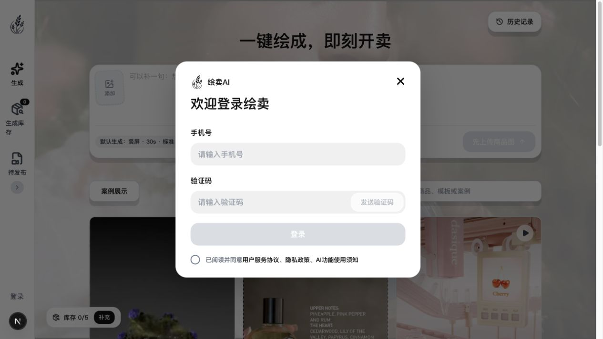
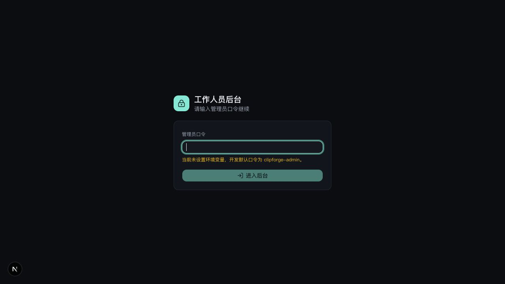
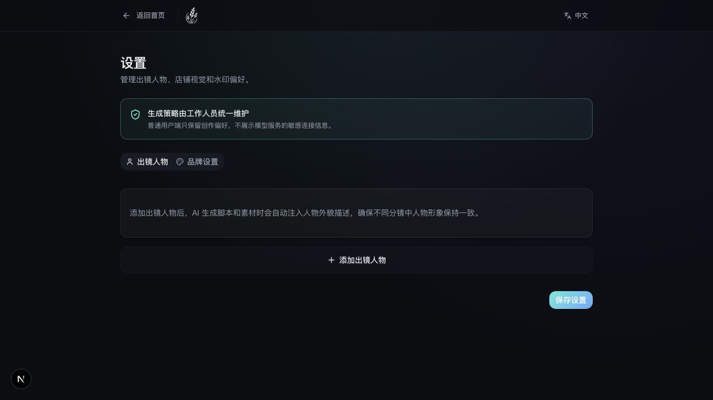
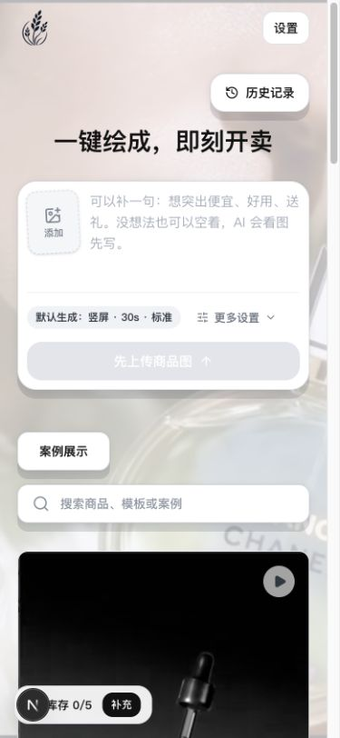

# 绘卖 / ClipForge 产品落地体检

日期：2026-07-10  
范围：落地页、创作工作台、用户登录、工作人员登录、设置、移动端、测试/构建、API、数据与任务链路。

## 结论

当前版本能够构建，也已经具备脚本、素材、视频合成、发布文案与后台 Agent 配置等大量核心能力；但它还不能作为公开 Web SaaS 上线。

根因不是“登录页面没做完”这么简单，而是两套产品形态混在了一起：

- 底层是 Electron / Docker / SQLite / 本地文件系统组成的单机或单租户工具。
- 页面和 README 又在表达面向多商家的 Web 产品，包括手机号登录、商家数据、套餐和运营后台。

因此登录目前只是视觉层，本地数据也没有用户归属。公开部署会产生数据泄露和 AI 调用被滥用的风险。

## 审计步骤与健康度

### 1. 对外落地页 — 有条件可用

- 优点：主 CTA 清楚，首屏素材有辨识度。
- 问题：导航文字压在复杂深色背景上，对比度不足；页面承诺“一键成片”，后续实际仍需脚本、素材、合成等多个步骤。

### 2. 桌面创作工作台 — 主流程骨架可用

- 优点：上传入口、默认生成设置、案例和历史入口集中，首要任务清楚。
- 问题：“开始生成视频”实际上只创建项目、上传图片和生成脚本，然后跳到脚本编辑页；与按钮文案的结果预期不一致。
- 问题：项目历史来自服务端 SQLite，认可/已发布状态来自浏览器 localStorage，换设备或浏览器后状态会分裂。

### 3. 用户登录 — 不可上线

- 实测任意手机号、任意验证码都能登录。
- “发送验证码”没有服务端请求，只会把按钮改成“已发送”。
- 登录态只是 `localStorage` 中的一段手机号 JSON，没有服务端会话、用户记录、过期验证或退出流程。
- 用户协议、隐私政策和 AI 使用须知只是文字，不是可打开的文档链接。
- 弹窗缺少 `role="dialog"`、`aria-modal`、焦点圈定和明确的错误恢复流程。

### 4. 工作人员后台登录 — 功能存在但默认状态危险

- 后台路由确实受口令 Cookie 保护。
- 未配置环境变量时会启用并在页面公开提示开发默认口令；如果误部署到公网，任何人都可以进入后台。
- Cookie 未显式设置 `secure`，登录接口没有失败次数限制；会话 token 是由口令和 secret 确定性计算的固定值。

### 5. 设置页 — 视觉清楚，数据没有账号归属

- 普通用户看不到模型密钥，策略由工作人员维护，这个方向是正确的。
- 出镜人物、品牌、模板、认可视频等仍主要持久化在 localStorage；数据库虽然定义了部分对应表，但没有形成完整读写 API。
- “保存设置”缺少明显的保存成功/失败反馈和跨设备同步说明。

### 6. 移动端工作台 — 基础重排可用，登录入口缺失

- 上传区和案例区能在窄屏重排。
- 桌面登录按钮位于 `lg` 以上才显示的侧栏；移动端头部只有 logo 和设置，用户无法进入登录弹窗。
- 桌面端的生成库存、待发布等主导航也没有等价的移动端入口。

## 上线阻断问题（P0）

### P0-1：公开 API 没有用户鉴权和数据隔离

未登录请求 `/api/project` 实测返回 HTTP 200，并暴露现有项目、商品信息和素材地址。项目 GET/POST/PATCH/DELETE、上传、素材、生成和文件接口均没有用户身份校验；数据库的 `projects` 也没有 `userId` / `workspaceId`。

需要：

1. 建立 `users`、`sessions`、`workspaces`、`memberships`。
2. 所有业务表加入 `workspaceId` 或 `ownerId`。
3. Route Handler 统一通过服务端鉴权中间层取当前用户。
4. 查询和写入都强制带租户条件；不能只在前端隐藏入口。
5. 上传和输出文件使用不可猜测、受鉴权或签名 URL 的访问方式。

### P0-2：用户登录是演示交互，不是认证

需要删除前端伪登录逻辑，并接入真实服务端认证。若使用手机号登录，还需要短信服务、验证码存储、时效、发送冷却、失败次数、风控、会话撤销和退出登录。

### P0-3：默认后台口令必须 fail closed

生产环境未设置管理员口令或 session secret 时，应用应该拒绝启动后台或返回配置错误，不能继续使用开发默认值。Cookie 需要 `secure`、合理的过期/轮换策略，并给登录接口加限流与审计。

### P0-4：必须先决定产品交付形态

- 如果目标是单机桌面版：SQLite、本地文件、localStorage 可以保留；应移除伪手机号登录，把身份概念改成“本机工作区/许可证”。
- 如果目标是公开 Web SaaS：需要迁移到服务端多租户数据库、对象存储和持久任务队列；当前本地文件与 SQLite 架构不能直接横向扩容。

## 重要完整性问题（P1）

### P1-1：状态被拆在 SQLite 与浏览器 localStorage

项目和合成记录在 SQLite；商品库、人物、品牌、模板、认可/发布状态和部分设置在 localStorage。结果是换浏览器、清缓存或多端使用时数据不一致，也无法由客服或运营后台查看真实商家状态。

### P1-2：视频合成任务不是持久任务

接口返回 202 后，通过进程内 `void async` 继续跑 TTS 和 FFmpeg。进程重启会丢失正在执行的任务和内存错误详情。Web 版本需要持久队列、worker、重试、幂等、取消与任务日志。

### P1-3：AI 生成接口没有用户配额与入站限流

公开调用可能直接消耗后台配置的 LLM、生图、生视频和 TTS 额度。需要在鉴权之后增加套餐/额度、并发上限、单任务成本预算、请求限流和使用账单。

### P1-4：测试与 CI 已经失真

- 单测结果：43 个文件通过、3 个文件失败；421 项中 419 项通过、2 项失败。
- 图片/视频 Agent 测试使用了旧 mock 路径，导致测试误打真实 provider。
- 图片工具和 store 测试仍引用目录迁移前的旧文件位置。
- E2E 冒烟脚本仍期待旧的商品库、新建表单和 AI 平台设置页；CI 只跑 lint、unit test 和 build，并没有执行 E2E。

### P1-5：产品说明与实现边界不一致

README 把商家建档、套餐余额、任务监控、商家管理、服务通知等列为产品/MVP组成，但当前没有用户表、套餐/支付、商家后台或真实通知链路。需要把“已实现、开发中、规划”拆开，避免用规划文案验收当前产品。

### P1-6：法律与数据治理缺失

页面展示协议勾选，但仓库没有对应协议/隐私文档；也没有账号注销、数据导出、数据删除、素材留存周期和用户上传内容处理说明。

## 体验与工程问题（P2）

- 落地页导航对比度不足。
- 移动端缺少登录、库存和待发布入口。
- 库存空状态缺少直接返回创作的主 CTA。
- 用户登录弹窗缺少可访问性语义、倒计时、错误态和焦点管理。
- 构建依赖在线获取 Google Fonts；离线/受限网络构建会失败，建议自托管字体。
- 构建提示 `metadataBase` 未配置，分享卡片在生产环境可能错误回落到 localhost。
- 未发现 CSP、HSTS、X-Frame-Options、Referrer-Policy 等生产安全响应头。
- 生产构建成功，但仍有 Next 文件追踪警告；lint 通过并有 18 个 warning。

## 推荐实施顺序

### 阶段 A：安全止血与真实状态

- 明确 SaaS 或单机桌面方向。
- 修复单测和 CI，让主干恢复可信。
- 移除伪登录；后台默认口令改为 fail closed。
- 在公开部署前临时封闭所有业务 API 和文件接口。

### 阶段 B：账号与数据底座（Web SaaS 路径）

- 真实登录、退出、会话、用户/工作区/成员模型。
- PostgreSQL 多租户迁移与项目归属。
- 商品、人物、品牌、模板、认可/发布状态从 localStorage 迁到服务端。
- 对象存储与签名文件 URL。

### 阶段 C：可靠任务与成本控制

- 持久队列 + worker 处理脚本、素材、视频和导出任务。
- 任务进度、失败原因、重试、取消、幂等。
- 套餐/额度/并发限制/成本记录与运营监控。

### 阶段 D：完整产品流程

- 首次登录与商家建档。
- 真实“上传 → 脚本确认 → 素材 → 合成 → 入库 → 导出发布”闭环。
- 登录、移动导航、空状态、法律文档、无障碍和错误恢复。
- 将关键 E2E 流程加入 CI。

## 本轮验证结果

- `npm run lint`：通过，18 个 warning。
- `npm test`：失败，3 个测试文件有问题；已定位到旧导入和旧 mock 路径。
- `npm run build`：联网环境下成功；受限网络会因 Google Fonts 下载失败。
- 桌面与 390×844 移动视口均已实际打开并截图。
- 未修改业务代码、数据库或飞书文档。
