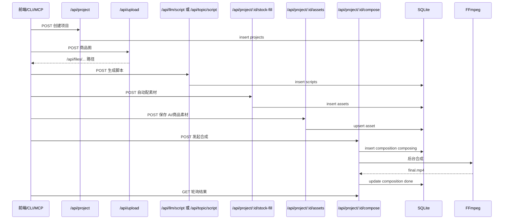

# ClipForge 后端白话手册

这份手册只看后端分类内容。总手册见 `ClipForge-白话详细手册.md`。

## 后端一句话

ClipForge 后端是一排服务柜台：项目柜台记账，LLM 柜台写脚本，AI 柜台生图生视频，素材柜台采购画面，合成柜台调用 FFmpeg 出片。

术语提示：
- [Route Handler：Next.js 里的 HTTP 服务窗口]
- [ORM：把数据库表翻译成代码对象的翻译官]
- [SSRF：程序被诱导访问内网地址的安全坑]
- [异步任务：先拿小票，稍后再取餐的后台工作]
- [WAL：SQLite 的并发记账模式，让读写更顺滑]

## API 分组

| 分组 | 文件 | 职责 |
|---|---|---|
| 项目 | `src/app/api/project/route.ts`, `src/app/api/project/[id]/route.ts` | 创建、读取、更新、删除项目。 |
| 脚本 | `src/app/api/llm/script/route.ts`, `src/app/api/topic/script/route.ts`, `src/app/api/project/[id]/scripts/route.ts` | 生成、保存、选择脚本。 |
| 素材 | `src/app/api/project/[id]/assets/route.ts`, `src/app/api/project/[id]/stock-fill/route.ts`, `src/app/api/stock/search/route.ts` | 存素材、自动配素材、搜索素材。 |
| AI 生成 | `src/app/api/ai/image/route.ts`, `src/app/api/ai/video/route.ts`, `src/app/api/ai/status/route.ts`, `src/app/api/ai/models/route.ts` | 生图、生视频、查任务、列模型。 |
| 合成 | `src/app/api/project/[id]/compose/route.ts`, `src/app/api/project/[id]/bgm/route.ts`, `src/app/api/project/[id]/subtitle/route.ts`, `src/app/api/project/[id]/export-platform/route.ts` | 配音、BGM、字幕、FFmpeg 合成和导出。 |
| 文件 | `src/app/api/upload/route.ts`, `src/app/api/products/upload/route.ts`, `src/app/api/files/[...path]/route.ts`, `src/app/api/output/[...path]/route.ts` | 上传和读取本地文件。 |
| 运营 | `src/app/api/llm/publish/route.ts`, `src/app/api/project/[id]/metrics/route.ts`, `src/app/api/insights/styles/route.ts` | 发布文案和效果回流。 |
| 工具入口 | `bin/clipforge.mjs`, `mcp/clipforge-mcp.mjs` | 命令行和 AI Agent 调用同一套 API。 |

## 数据层

| 表 | 位置 | 白话作用 |
|---|---|---|
| `projects` | `src/lib/db/schema.ts:3-27` | 项目总档案，记录商品、主题、状态、图片。 |
| `scripts` | `src/lib/db/schema.ts:29-40` | 脚本方案账本，shots 是分镜 JSON。 |
| `assets` | `src/lib/db/schema.ts:61-79` | 每个分镜用了哪份素材，并记录作者/授权。 |
| `compositions` | `src/lib/db/schema.ts:96-109` | 成片输出记录。 |
| `products` | `src/lib/db/schema.ts:111-124` | 商品库。 |
| `brandSettings` | `src/lib/db/schema.ts:126-139` | 品牌视觉设置。 |
| `scriptTemplates` | `src/lib/db/schema.ts:141-153` | 可复用脚本模板。 |
| `characters` | `src/lib/db/schema.ts:155-166` | 出镜人物资料。 |
| `publishMetrics` | `src/lib/db/schema.ts:42-59` | 发布后效果数据。 |

数据库启动：
- `src/lib/db/index.ts:9-18`：确定数据库文件目录。
- `src/lib/db/index.ts:20-31`：打开 SQLite、启用 WAL 和外键。
- `src/lib/db/index.ts:36-48`：运行时自动迁移，避免空库没表。

## 业务链路：从项目到成片



## 核心后端模块

### 1. LLM 脚本引擎

| 位置 | 白话解释 |
|---|---|
| `src/lib/script-engine/generator.ts:95-101` | 创建 OpenAI 兼容客户端，像给不同大模型套同一个电话拨号器。 |
| `src/lib/script-engine/generator.ts:119-133` | 从模型返回中抠 JSON，兼容模型把 JSON 包进代码块的情况。 |
| `src/lib/script-engine/generator.ts:147-181` | 修正分镜字段，防止模型漏填导致后面流水线摔倒。 |
| `src/lib/script-engine/generator.ts:211-238` | 带货脚本生成主函数。 |
| `src/lib/script-engine/generator.ts:252-279` | 一句话主题脚本生成主函数。 |
| `src/lib/script-engine/generator.ts:417-448` | 商品图视觉分析。 |

### 2. AI Provider

| 位置 | 白话解释 |
|---|---|
| `src/lib/providers/types.ts:201-235` | 统一规定平台必须会生图、生视频、查状态、列模型。 |
| `src/lib/providers/base.ts:63-144` | 通用请求员，负责超时、重试、错误翻译。 |
| `src/lib/providers/base.ts:162-202` | 异步任务轮询，像拿小票等外部平台出餐。 |
| `src/lib/providers/index.ts:27-68` | 内置平台注册表。 |
| `src/lib/providers/index.ts:93-104` | 按平台名创建具体 Provider。 |

### 3. 素材采购

| 位置 | 白话解释 |
|---|---|
| `src/lib/providers/stock-types.ts:63-123` | 所有素材源的名册，标注是否免 Key、支持图片/视频/音频。 |
| `src/lib/providers/stock-registry.ts:60-108` | 单源检索分发。 |
| `src/lib/providers/stock-registry.ts:131-166` | 聚合检索，多源并发，单源失败不拖垮全局。 |
| `src/lib/providers/stock-registry.ts:173-201` | 候选排序，本地/免 Key/竖屏优先。 |
| `src/app/api/project/[id]/stock-fill/route.ts:79-104` | 按分镜有界并发配素材。 |

### 4. 视频合成

| 位置 | 白话解释 |
|---|---|
| `src/app/api/project/[id]/compose/route.ts:99-230` | 合成 API 读取项目、脚本、素材，先写一条 composing 记录。 |
| `src/app/api/project/[id]/compose/route.ts:230-372` | 后台异步跑 TTS 和 FFmpeg，避免 HTTP 请求长时间挂住。 |
| `src/lib/video-composer/composer.ts:270-560` | 组装完整 FFmpeg 命令。 |
| `src/lib/video-composer/composer.ts:412-459` | 字幕烧录。 |
| `src/lib/video-composer/composer.ts:494-530` | 商品卡贴片。 |
| `src/lib/video-composer/composer.ts:566-603` | 合成错误转成用户能看懂的提示。 |

## 安全边界

| 风险 | 已有防护 | 位置 |
|---|---|---|
| 路径穿越 | projectId/productId 白名单、normalize 后确认根目录 | `src/app/api/upload/route.ts:38-41`, `src/app/api/files/[...path]/route.ts:14-23` |
| 上传文件伪装 | MIME、扩展名、大小限制 | `src/app/api/upload/route.ts:6-22`, `src/app/api/project/[id]/materials/route.ts:7-18` |
| 商品链接 SSRF | `safeFetch` 抓 HTML 和图片 | `src/app/api/ingest/product/route.ts:8-18`, `src/lib/ssrf-guard.ts` |
| FFmpeg 命令注入 | 路径/文本转义和白名单参数 | `src/lib/video-composer/composer.ts:38-91`, `src/lib/compose-presets.ts` |
| 外部 API 瞬时失败 | Provider 请求重试 429/5xx | `src/lib/providers/base.ts:84-144` |
| 空素材合成 | 合成前检查至少有素材 | `src/app/api/project/[id]/compose/route.ts:197-204` |

## 后端二次开发热点

### 添加新 Provider

1. 新建 `src/lib/providers/<name>.ts`。
2. 实现 `AIProvider` 四件套：`generateImage`、`generateVideo`、`getTaskStatus`、`listModels`。
3. 继承 `BaseProvider` 复用请求、超时、轮询。
4. 在 `src/lib/providers/index.ts:27-68` 注册。
5. 在 `src/lib/stores/settings-store.ts:92-99` 加默认配置。
6. 在设置页和 i18n 中补展示文案。
7. 写 Provider 响应防守测试。

### 添加新素材源

1. 在 `src/lib/providers/stock-types.ts:9-123` 增加 source id 和元信息。
2. 新建 `src/lib/providers/<source>.ts`，把平台返回归一成 `StockCandidate`。
3. 在 `src/lib/providers/stock-registry.ts:60-108` 增加 switch 分支。
4. 如果需要 Key，配置 `envKey`，让 `resolveSourceKey()` 自动读取。
5. 补 `src/lib/__tests__/stock-sources.test.ts` 或新测试。

### 添加新合成能力

1. 在 `src/lib/video-composer/composer.ts:194-240` 扩展 `ComposeConfig`。
2. 在 `src/app/api/project/[id]/compose/route.ts:296-356` 解析请求体。
3. 在 `buildComposeCommand()` 对应阶段加入滤镜或参数。
4. 同步前端 `src/app/project/[id]/video/page.tsx`，CLI `bin/clipforge.mjs:84-98`，MCP `mcp/clipforge-mcp.mjs:73-107`。
5. 写纯函数测试，尤其要覆盖非法参数和 FFmpeg 错误提示。

## 后端验证清单

每次改后端至少检查：

```bash
pnpm lint
pnpm test
pnpm build
```

涉及视频合成时手动跑：

1. `/start` 创建一个主题或商品项目。
2. 生成脚本。
3. 自动配画面。
4. 合成视频。
5. 打开 `/api/project/<id>/compose` 看 `status=done` 和 `url`。

涉及 Docker 时看 `.github/workflows/docker-publish.yml:40-54` 的冒烟逻辑，本地也应确认 `/start` 返回 200，`ffmpeg -version` 可用。

## 易冲突后端文件

| 文件 | 冲突原因 | 建议 |
|---|---|---|
| `src/lib/db/schema.ts` | 表字段集中。 | schema 改动单独 PR，提交迁移。 |
| `drizzle/meta/*` | 迁移快照会随 schema 变化。 | 不手工拼编号，统一用 drizzle-kit。 |
| `src/lib/providers/index.ts` | Provider 注册集中。 | 新平台独立文件，注册块排序。 |
| `src/lib/providers/stock-registry.ts` | 素材源 switch 集中。 | 新源只加一个清晰分支，测试覆盖。 |
| `src/app/api/project/[id]/compose/route.ts` | 合成入参和后台任务集中。 | 新合成选项先抽纯函数，减少大文件冲突。 |
| `src/lib/video-composer/composer.ts` | FFmpeg 命令很长。 | 改前先写测试，改动按视频/音频/字幕分块。 |

